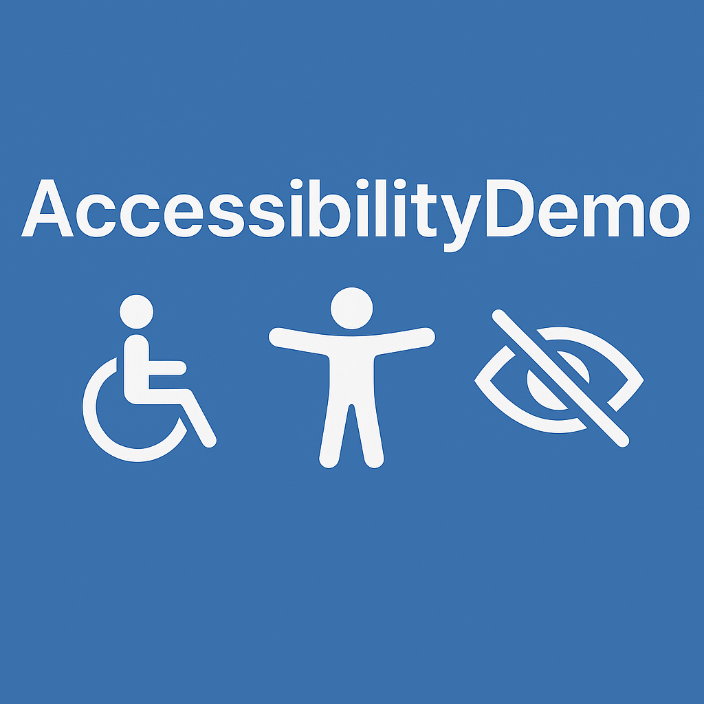

# Accessibility Demo - Learning Guide



Learn web accessibility through two HTML files: one with common accessibility problems and another showing the fixes. Perfect for developers learning WCAG 2.1 AA compliance.

## 🚀 Quick Start

1. **Explore the demos**:
   - `accessibility-issues-demo.html` - Shows accessibility violations
   - `accessibility-fixed-demo.html` - Shows proper implementation
2. **Test with tools**: Use keyboard navigation, screen readers, and automated testing
3. **Learn the patterns**: Review this guide to understand each issue and fix

## What You'll Learn

**13+ common accessibility issues** with solutions:

1. **Poor Color Contrast** - Text that fails WCAG standards
2. **Missing Alt Text** - Images without descriptions
3. **Improper Heading Hierarchy** - Skipping heading levels
4. **Forms Without Labels** - Input fields missing labels
5. **Non-Semantic Elements** - Divs instead of buttons/links
6. **Poor Link Text** - "Click here" links without context
7. **Tables Without Headers** - Missing table headers and scope
8. **Auto-playing Media** - Videos without user control
9. **Text Too Small** - Font sizes below readable standards
10. **Missing Language** - No lang attribute
11. **Poor Focus Management** - No visible focus indicators
12. **Inaccessible Controls** - Dropdowns without keyboard support
13. **Blinking Content** - Animations that can trigger seizures

## 🧪 Testing Tools

### Manual Testing
- **Keyboard**: Tab through both demos
- **Screen Reader**: Use NVDA, JAWS, or VoiceOver
- **Browser Tools**: Chrome DevTools Lighthouse

### Automated Tools
- **Accessibility Insights** - [Download here](https://accessibilityinsights.io/downloads)
- **axe DevTools** - Browser extension
- **WAVE** - Web accessibility evaluation
- **Lighthouse** - Built into Chrome

## � Automated Testing Workflows

Three CI/CD workflows run on every push and PR:

### 1. axe-core Testing
- Tests both HTML files automatically
- Generates detailed violation reports
- Fails builds for serious violations in fixed demo

### 2. Pa11y Testing  
- Command-line accessibility testing
- WCAG2AA standard compliance
- Comments results on pull requests

### 3. AI-Powered Analysis
- Uses GPT-4.1 via GitHub Models
- Comprehensive WCAG 2.1 AA analysis
- Detailed remediation guidance

**Local Testing:**
```bash
# axe-core
npm install --save-dev @axe-core/cli serve
npx serve . -l 3000 &
npx axe http://localhost:3000/accessibility-issues-demo.html

# Pa11y
npm install -g pa11y-ci
python -m http.server 8080
pa11y http://localhost:8080/accessibility-issues-demo.html --standard WCAG2AA

# AI Analysis (requires MODELS_TOKEN)
pip install requests
python ai_accessibility_analyzer.py
```

```

## 📋 WCAG Guidelines

- **Level A**: Minimum accessibility
- **Level AA**: Standard level (recommended)  
- **Level AAA**: Highest level (government/critical services)

Target **WCAG 2.1 AA** for best balance of accessibility and practicality.

## 🛠️ AI-Assisted Fixes

### GitHub Copilot Prompts
```
Fix color contrast issues to meet WCAG AA standards
Add proper alt text to all images  
Correct heading hierarchy starting with h1
Make form fields properly labeled with semantic elements
```

### Working with Issues
```bash
@github Create issue for missing alt text in accessibility-issues-demo.html
@github Start working on issue #123 about alt text
@github Fix contrast issues to meet WCAG 2.1 AA standards
```

## 📚 Resources

- [WCAG 2.1 Guidelines](https://www.w3.org/WAI/WCAG21/quickref/)
- [WebAIM](https://webaim.org/) - Practical resources and tools
- [A11y Project](https://www.a11yproject.com/) - Community checklist
- [MDN Accessibility](https://developer.mozilla.org/en-US/docs/Web/Accessibility)

## 🤖 How This Was Created

Generated with AI using this prompt:
```
create a simple html file to showcase how to fix accessibility issues. make the page deliberately non accessibility with a few issues. use plain html
```

**Result**: Two HTML files, 13+ accessibility patterns, automated testing workflows, and comprehensive learning guide.

## 🤖 AI Analysis Setup

Quick setup for GPT-4.1 accessibility analysis:

1. **Get access** at [github.com/marketplace/models](https://github.com/marketplace/models)
2. **Create token** with Models scope in GitHub Settings  
3. **Add secret** `MODELS_TOKEN` to repository
4. **Run automatically** on pushes/PRs or manually in Actions tab

---

**Remember:** Accessibility benefits everyone - better SEO, usability, and user experience.

### Setup Instructions

#### 1. Get GitHub Models Access
GitHub Models provides access to advanced AI models including GPT-4.1:
- Visit [GitHub Models](https://github.com/marketplace/models)
- Sign in with your GitHub account
- Test models directly in the interface

#### 2. Configure Repository Secrets
1. **Create Personal Access Token**:
   - Go to GitHub Settings → Developer settings → Personal access tokens → Fine-grained tokens
   - Create token with `Models` scope enabled
   - Copy the token value

2. **Add Repository Secret**:
   - Navigate to repository Settings → Secrets and variables → Actions
   - Click **New repository secret**
   - Name: `MODELS_TOKEN`
   - Value: Paste your token
   - Click **Add secret**

#### 3. Run the Analysis
The AI checker runs automatically on pushes and pull requests, or manually via Actions tab.

### Sample AI Output
```markdown
## Accessibility Issue: Missing Alt Text
- **Severity**: High
- **WCAG Guideline**: 1.1.1 Non-text Content
- **Issue**:  lacks alternative text
- **Remediation**: Add alt attribute: 
- **User Impact**: Screen reader users cannot understand image content
```

---
