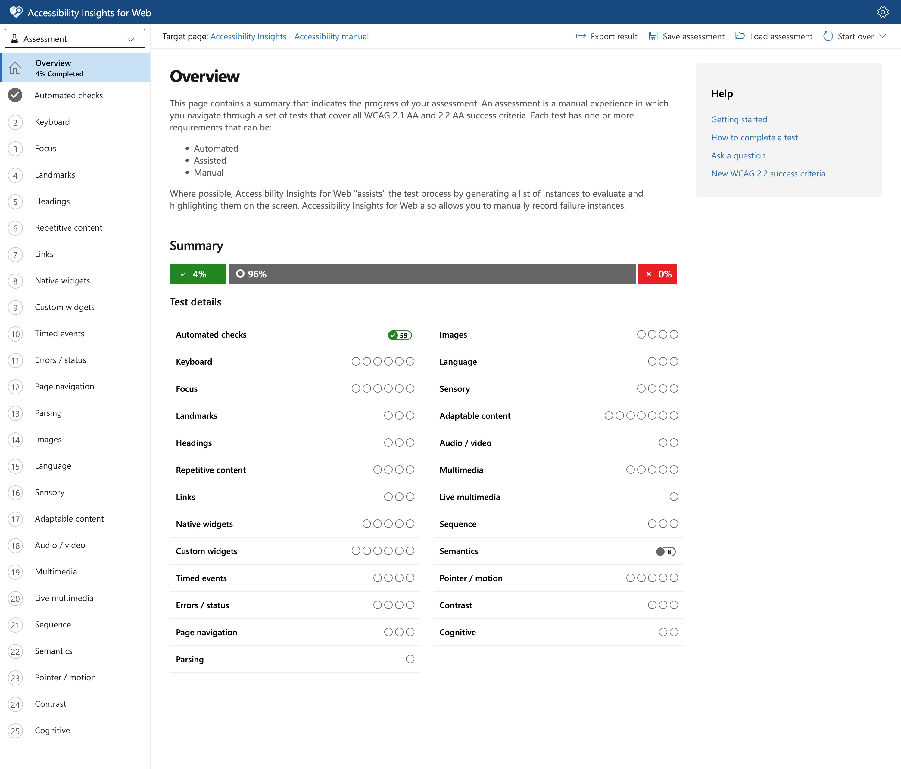

# Accessibility Issues Demo - Learning Guide

## 📊 Automated Accessibility Report

This project’s GitHub Actions workflow now generates a detailed HTML accessibility report on every run.

### How it works

- After running automated accessibility tests, the workflow creates an `accessibility-report.html` file.
- The report summarizes all violations for both the “issues” and “fixed” demo pages, with clear descriptions and affected elements.
- The HTML report is uploaded as a workflow artifact for easy download and review.

### How to view the report

1. Push your changes or open a pull request to trigger the workflow.
2. Go to the “Actions” tab in your GitHub repository.
3. Select the latest workflow run.
4. Download the `axe-results` artifact.
5. Open `accessibility-report.html` in your browser for a full, readable summary of the results.


This project demonstrates common web accessibility issues and their solutions. The goal is to help developers understand what makes websites inaccessible and how to fix these problems.

## 🤖 How to Recreate This Project with GitHub Copilot (Claude 4)

If you want to recreate this accessibility demo project using GitHub Copilot with Claude 4, here's the exact prompt that generated this comprehensive example:

### Prompt for GitHub Copilot:
```
create a simple html file to showcase how to fix accessibility issues. make the page deliberately non accessibility with a few issues. use plain html
```

### What Claude 4 Generated:
Claude 4 understood this request and automatically created:

1. **Two HTML files** - One with accessibility issues and one with fixes
2. **Comprehensive documentation** - This README with detailed explanations
3. **Real-world examples** - 13+ common accessibility violations and their solutions
4. **WCAG compliance mapping** - Each issue mapped to specific WCAG guidelines
5. **Testing guidance** - How to test accessibility manually and with tools

### Why This Prompt Worked Well:

- **Clear objective**: "showcase how to fix accessibility issues"
- **Specific request**: "deliberately non accessibility with a few issues"
- **Technology constraint**: "use plain html"
- **Educational intent**: The prompt implied learning/demonstration purposes

### Alternative Prompts You Could Try:

```
Create an accessibility audit example with before/after HTML pages showing WCAG violations and fixes
```

```
Build a web accessibility training demo with HTML files showing common a11y issues and their solutions
```

```
Generate a complete accessibility learning project with problematic HTML and corrected versions plus documentation
```

### Tips for Getting Better Results from Claude 4:

1. **Be specific about the educational goal**: Mention if it's for learning, training, or demonstration
2. **Request both problems and solutions**: Ask for "before and after" examples
3. **Specify documentation needs**: Ask for explanations if you want them
4. **Mention standards**: Reference WCAG, Section 508, or specific compliance levels if needed
5. **Request testing guidance**: Ask for information about how to test the results

### Example Enhanced Prompt:
```
Create a comprehensive web accessibility learning project with:
- An HTML page with 10+ deliberate accessibility violations
- A fixed version demonstrating WCAG 2.1 AA compliance
- Documentation explaining each issue and fix
- Testing recommendations for manual and automated accessibility testing
Use semantic HTML and include real-world examples that developers commonly encounter
```

---

## Files in this project:

1. **accessibility-issues-demo.html** - Shows common accessibility violations
2. **accessibility-fixed-demo.html** - Shows the same content with proper accessibility implementation
3. **README.md** - This documentation file

## Common Accessibility Issues Demonstrated

### 1. **Poor Color Contrast**
- **Issue**: Yellow background with white text (fails WCAG contrast requirements)
- **Fix**: Use high contrast colors (dark text on light background or vice versa)
- **WCAG Guideline**: 1.4.3 Contrast (Minimum) - AA level requires 4.5:1 ratio for normal text

### 2. **Missing Alt Text on Images**
- **Issue**: Images without alt attributes or inappropriate alt text
- **Fix**: 
  - Informative images: Descriptive alt text
  - Decorative images: Empty alt text (`alt=""`) or `role="presentation"`
- **WCAG Guideline**: 1.1.1 Non-text Content

### 3. **Improper Heading Hierarchy**
- **Issue**: Skipping heading levels (h3 before h1)
- **Fix**: Use headings in logical order (h1 → h2 → h3, etc.)
- **WCAG Guideline**: 1.3.1 Info and Relationships

### 4. **Forms Without Proper Labels**
- **Issue**: Form inputs without associated labels or with hidden labels
- **Fix**: 
  - Use `<label for="input-id">` properly
  - Add `aria-describedby` for additional help text
  - Use `required` attribute for required fields
- **WCAG Guideline**: 1.3.1 Info and Relationships, 3.3.2 Labels or Instructions

### 5. **Non-Semantic Interactive Elements**
- **Issue**: Using `<div>` with click handlers instead of proper buttons
- **Fix**: Use semantic HTML (`<button>`, `<a>`, etc.)
- **WCAG Guideline**: 4.1.2 Name, Role, Value

### 6. **Poor Link Text**
- **Issue**: "Click here" and "Read more" links without context
- **Fix**: Use descriptive link text that makes sense out of context
- **WCAG Guideline**: 2.4.4 Link Purpose (In Context)

### 7. **Data Tables Without Headers**
- **Issue**: Tables without proper `<th>` elements and scope attributes
- **Fix**: 
  - Use `<th>` for headers
  - Add `scope="col"` or `scope="row"`
  - Include `<caption>` for table description
- **WCAG Guideline**: 1.3.1 Info and Relationships

### 8. **Blinking/Flashing Content**
- **Issue**: Content that blinks or flashes automatically
- **Fix**: Remove auto-animations or provide controls to stop them
- **WCAG Guideline**: 2.3.1 Three Flashes or Below Threshold

### 9. **Text Too Small**
- **Issue**: Text smaller than 16px (or equivalent)
- **Fix**: Use appropriate font sizes (minimum 16px for body text)
- **WCAG Guideline**: 1.4.4 Resize text

### 10. **Missing Language Declaration**
- **Issue**: No `lang` attribute on `<html>` element
- **Fix**: Add `lang="en"` (or appropriate language code)
- **WCAG Guideline**: 3.1.1 Language of Page

### 11. **Auto-playing Media**
- **Issue**: Videos that auto-play without user control
- **Fix**: 
  - Remove autoplay
  - Provide controls
  - Add captions/transcripts
- **WCAG Guideline**: 1.4.2 Audio Control, 1.2.1 Audio-only and Video-only

### 12. **Inaccessible Custom Controls**
- **Issue**: Custom dropdowns without keyboard support or ARIA attributes
- **Fix**: 
  - Use native `<select>` elements when possible
  - Add proper ARIA attributes for custom controls
  - Ensure keyboard accessibility
- **WCAG Guideline**: 2.1.1 Keyboard, 4.1.2 Name, Role, Value

### 13. **Poor Focus Management**
- **Issue**: Elements that can receive focus but don't provide clear focus indicators
- **Fix**: 
  - Ensure visible focus indicators
  - Proper tab order
  - Don't use `tabindex` > 0
- **WCAG Guideline**: 2.4.7 Focus Visible, 2.4.3 Focus Order

## Accessibility Best Practices Implemented in the Fixed Version

### Semantic HTML Structure
- Proper use of `<header>`, `<main>`, `<nav>`, `<section>`, `<footer>`
- Logical heading hierarchy
- Semantic form elements with proper labeling

### ARIA (Accessible Rich Internet Applications)
- `aria-label` for navigation
- `aria-describedby` for form help text
- `role="alert"` for important messages
- `aria-live` regions for dynamic content

### Keyboard Accessibility
- All interactive elements are keyboard accessible
- Visible focus indicators
- Skip links for keyboard navigation
- Proper tab order

### Screen Reader Support
- Screen reader only content with `.sr-only` class
- Proper table headers with scope attributes
- Descriptive link text
- Form labels and instructions

### Color and Contrast
- High contrast color combinations
- Information not conveyed by color alone
- Sufficient color contrast ratios

### Responsive Design
- Viewport meta tag
- Flexible layouts
- Touch-friendly target sizes (minimum 44px)

## Testing Your Accessibility

### Automated Testing Tools
- **axe-core**: Browser extension for automated accessibility testing
- **WAVE**: Web accessibility evaluation tool
- **Lighthouse**: Built into Chrome DevTools

### 🚀 Automated CI/CD Testing with GitHub Actions

This project includes a GitHub Action that automatically tests both HTML files for accessibility issues on every push and pull request.

#### What the GitHub Action Does:
1. **Sets up testing environment** with Node.js and accessibility tools
2. **Starts a local server** to serve the HTML files
3. **Runs axe-core tests** on both demo files
4. **Generates detailed reports** with violation descriptions and impact levels
5. **Uploads results as artifacts** for download and review
6. **Comments on pull requests** with accessibility findings
7. **Fails the build** if the fixed demo has critical/serious violations

#### Workflow File Location:
```
.github/workflows/accessibility-check.yml
```

#### Key Features:
- **Automated on push/PR**: Runs automatically when code is pushed
- **Dual testing**: Tests both the broken and fixed versions
- **Detailed reporting**: Shows violation types, descriptions, and impact levels
- **Artifact storage**: Saves JSON results and markdown reports
- **PR integration**: Comments directly on pull requests with results
- **Quality gates**: Fails if the "fixed" version has serious accessibility issues

#### Expected Results:
- **Issues Demo**: Should find multiple violations (expected behavior)
- **Fixed Demo**: Should have zero or minimal violations

#### How to Use:
1. Push your changes to trigger the workflow
2. Check the "Actions" tab in your GitHub repository
3. Download the accessibility results from the workflow artifacts
4. Review any violations found in the fixed demo and address them

### 🔍 Pa11y Accessibility Testing

This project includes a **Pa11y workflow** (`.github/workflows/pa11y.yml`) that provides command-line accessibility testing using the industry-standard Pa11y tool.

#### Key Features:
- **WCAG2AA compliance testing** with axe-core runner
- **Concurrent testing** of both demo files for faster results
- **Automatic PR comments** with collapsible test results
- **CLI-focused approach** ideal for CI/CD integration

#### What It Does:
1. Sets up Pa11y-ci with Node.js environment
2. Starts Python HTTP server for local testing
3. Tests both HTML files against WCAG2AA standards
4. Uploads detailed CLI reports as artifacts
5. Posts results to pull requests automatically

#### Expected Results:
- **accessibility-issues-demo.html**: Expected to fail (demonstrates problems)
- **accessibility-fixed-demo.html**: Should pass all tests

#### Local Testing:
```bash
# Install and run Pa11y locally
npm install -g pa11y-ci
python -m http.server 8080

# Test files
pa11y http://localhost:8080/accessibility-issues-demo.html --standard WCAG2AA --runner axe
pa11y http://localhost:8080/accessibility-fixed-demo.html --standard WCAG2AA --runner axe
```

#### Why Pa11y?
Command-line focused, supports multiple runners (axe, htmlcs), flexible configuration, and works alongside other accessibility tools for comprehensive testing.

#### Local Testing Commands (axe-core):
If you want to run the same axe-core tests locally:

```bash
# Install dependencies
npm install --save-dev @axe-core/cli puppeteer serve

# Start local server
npx serve . -l 3000 &

# Run accessibility tests
npx axe http://localhost:3000/accessibility-issues-demo.html --reporter json
npx axe http://localhost:3000/accessibility-fixed-demo.html --reporter json
```

## WCAG 2.1 Compliance Levels

- **Level A**: Minimum level of accessibility
- **Level AA**: Standard level (recommended for most websites)
- **Level AAA**: Highest level (required for some government/critical services)

Most organizations aim for **WCAG 2.1 AA compliance** as it provides a good balance of accessibility and practicality.

## Resources for Learning More

- [Web Content Accessibility Guidelines (WCAG) 2.1](https://www.w3.org/WAI/WCAG21/quickref/)
- [WebAIM](https://webaim.org/) - Accessibility resources and testing tools
- [A11y Project](https://www.a11yproject.com/) - Community-driven accessibility resources
- [MDN Accessibility](https://developer.mozilla.org/en-US/docs/Web/Accessibility) - Technical documentation

## 🚀 Extending This Project with AI Assistance

### Using GitHub Copilot for Accessibility

This project demonstrates how AI tools like GitHub Copilot (powered by Claude 4) can help create comprehensive accessibility learning materials. Here are ways to extend this project:

#### Additional Features You Could Request:
```
Add ARIA live regions examples with dynamic content updates
```

```
Create keyboard navigation examples with focus trapping for modals
```

```
Generate accessibility test scripts using axe-core or similar tools
```

```
Add examples of accessible data visualizations and charts
```

```
Create mobile accessibility examples with touch targets and gestures
```

#### Advanced Prompts for Accessibility Work:

1. **Component-Specific Examples**:
   ```
   Create accessible React/Vue/Angular components with proper ARIA implementation
   ```

2. **Testing Automation**:
   ```
   Generate automated accessibility test suites using Playwright or Cypress
   ```

3. **Design System Integration**:
   ```
   Build an accessible design system with documented components and usage guidelines
   ```

4. **Performance + Accessibility**:
   ```
   Create examples showing how to optimize for both performance and accessibility
   ```

### Learning Path Recommendations

1. **Start here**: Use this demo to understand basic accessibility issues
2. **Practice**: Try fixing accessibility issues in your own projects
3. **Automate**: Learn to use accessibility testing tools
4. **Advanced**: Study ARIA patterns and complex widget accessibility
5. **Contribute**: Help improve accessibility in open source projects

### AI-Assisted Accessibility Workflow

1. **Audit Phase**: Use AI to help identify potential accessibility issues
2. **Learning Phase**: Ask for explanations of WCAG guidelines and best practices
3. **Implementation Phase**: Get code examples for accessible implementations
4. **Testing Phase**: Generate test scripts and validation approaches
5. **Documentation Phase**: Create comprehensive accessibility documentation

Remember: While AI tools are excellent for learning and generating examples, always validate accessibility implementations with real users, including people with disabilities.

## Quick Start Guide

## 🛠️ How to Fix Accessibility Issues with GitHub Copilot

You can use GitHub Copilot to quickly identify and fix accessibility issues in files like [`accessibility-issues-demo.html`](./accessibility-issues-demo.html). Copilot can suggest code changes, explain accessibility problems, and even generate accessible alternatives for problematic code.

### How to Use Copilot to Fix Accessibility Issues

1. **Open the file with issues** (e.g., `accessibility-issues-demo.html`).
2. **Highlight the problematic code** or place your cursor near it.
3. **Ask Copilot for a fix** using a prompt (see examples below).
4. **Review and accept Copilot’s suggestions**. Test the result for accessibility.

### Sample Copilot Prompts for Accessibility Fixes

Here are some example prompts you can use with Copilot to address issues in `accessibility-issues-demo.html`:

```
Fix all color contrast issues in this HTML file to meet WCAG AA standards.
```

```
Add missing alt text to all images and use empty alt for decorative images.
```

```
Correct the heading hierarchy so it starts with <h1> and follows logical order.
```

```
Make all form fields properly labeled and ensure the submit button is a semantic <button>.
```

```
Replace custom dropdown with a native <select> element for accessibility.
```

```
Remove or provide controls for any auto-playing or blinking content.
```

```
Add a lang attribute to the <html> tag and ensure proper page structure.
```

### Tips for Effective Copilot Prompts

- Be specific about the accessibility issue you want to fix.
- Reference WCAG guidelines if possible (e.g., "fix to meet WCAG 2.1 AA").
- Ask for both the fix and a brief explanation if you want to learn more.
- Always review Copilot’s suggestions and test with accessibility tools.

---

1. Open both HTML files in your browser
2. Compare the visual and functional differences
3. Use a screen reader to experience the differences
4. Test keyboard navigation on both versions
5. Run accessibility testing tools on both files

## 🧪 How to Test Accessibility with Accessibility Insights

[Accessibility Insights](https://accessibilityinsights.io/) is a free, open-source tool from Microsoft for finding and fixing accessibility issues in web pages and applications. It works as a browser extension for Chrome and Edge.

### Steps to Test Your HTML Files

1. **Install Accessibility Insights**
   - Go to [accessibilityinsights.io/downloads](https://accessibilityinsights.io/downloads) and install the browser extension for Chrome or Edge.

2. **Open your demo HTML file**
   - Open `accessibility-issues-demo.html` or `accessibility-fixed-demo.html` in your browser.

3. **Launch Accessibility Insights**
   - Click the Accessibility Insights icon in your browser toolbar.
   - Choose **FastPass** for a quick automated check, or **Assessment** for a comprehensive, step-by-step manual and automated audit.

4. **Review the results**
   - The tool will highlight accessibility issues directly on the page and provide detailed guidance for each issue, including:
     - Failing elements
     - WCAG references
     - How to fix the problem

5. **Fix issues and retest**
   - Use the guidance to update your HTML, then rerun the tool to verify fixes.

### Why Use Accessibility Insights?
- **Comprehensive**: Combines automated and guided manual testing
- **Actionable**: Gives clear instructions and code examples for fixes
- **Free and open source**: No cost, no sign-up required
- **Trusted**: Used by Microsoft and the accessibility community

For more information and tutorials, visit the [Accessibility Insights documentation](https://accessibilityinsights.io/docs/web/overview/).

### Example Screenshots

**1. FastPass Automated Check**



*Above: FastPass highlights accessibility issues directly on the page and lists them in a sidebar.*


**2. Assessment Panel**


*Above: The Assessment panel provides a comprehensive, guided audit with explanations and remediation steps for each requirement.*

Remember: Accessibility benefits everyone, not just users with disabilities. It improves SEO, usability, and creates a better web for all users.
