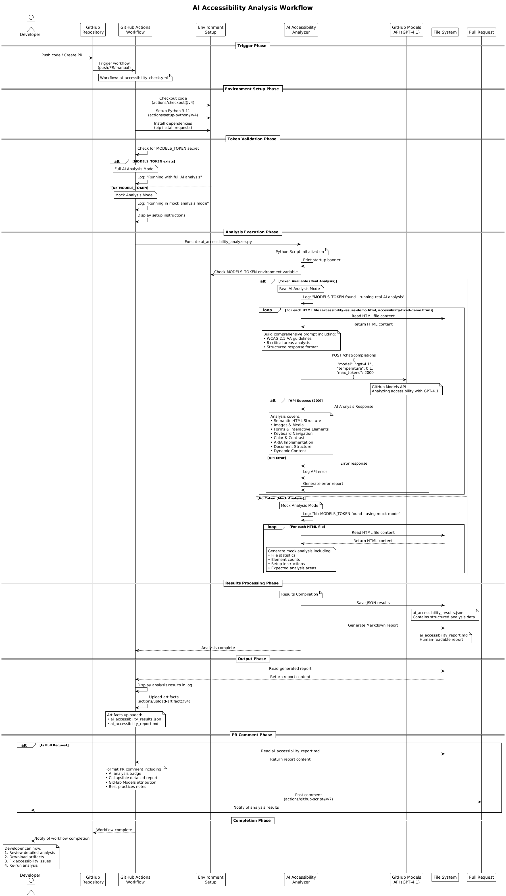
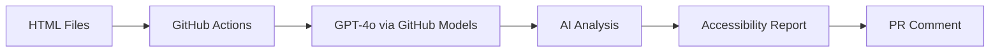

# Accessibility Issues Demo - Learning Guide 


This project demonstrates common web accessibility issues and their solutions through two HTML files: one with deliberate accessibility problems and another showing how to fix them. Perfect for developers learning accessibility best practices.

## 🚀 Quick Start

1. **Explore the demos**: Open both HTML files in your browser
   - `accessibility-issues-demo.html` - Shows common accessibility violations
   - `accessibility-fixed-demo.html` - Shows proper accessibility implementation
2. **Compare the differences**: Use keyboard navigation and screen readers on both
3. **Run accessibility tests**: Use automated tools to see the violations
4. **Learn from the patterns**: Review this guide to understand each issue and fix

## What You'll Learn

This project covers **13+ common accessibility issues** that developers encounter:

### Core Issues Demonstrated

1. **Poor Color Contrast** - Yellow text on white backgrounds that fail WCAG standards
2. **Missing Alt Text** - Images without proper alternative text descriptions
3. **Improper Heading Hierarchy** - Skipping heading levels (h3 before h1)
4. **Forms Without Labels** - Input fields missing proper labels and instructions
5. **Non-Semantic Elements** - Using divs instead of proper buttons and links
6. **Poor Link Text** - "Click here" links that lack context
7. **Data Tables Without Headers** - Tables missing proper th elements and scope
8. **Blinking/Flashing Content** - Auto-animations that can trigger seizures
9. **Text Too Small** - Font sizes below 16px that are hard to read
10. **Missing Language Declaration** - No lang attribute on HTML element
11. **Auto-playing Media** - Videos that auto-play without user control
12. **Inaccessible Custom Controls** - Dropdowns without keyboard support
13. **Poor Focus Management** - Elements without visible focus indicators

### Best Practices You'll Master

- **Semantic HTML Structure** with proper landmarks
- **ARIA Implementation** for complex interactive elements
- **Keyboard Accessibility** patterns and focus management
- **Screen Reader Support** with descriptive content
- **Color and Contrast** meeting WCAG AA standards
- **Responsive Design** with touch-friendly targets

## 🧪 Testing Your Accessibility

### Manual Testing
1. **Keyboard Navigation**: Tab through both demos - notice the differences
2. **Screen Reader**: Use NVDA, JAWS, or VoiceOver to hear how they sound
3. **Visual Inspection**: Check color contrast and text sizing
4. **Browser Tools**: Use Chrome DevTools Lighthouse accessibility audit

### Automated Testing Tools
- **Accessibility Insights** - Microsoft's free browser extension ([Download](https://accessibilityinsights.io/downloads))
- **axe DevTools** - Browser extension for automated accessibility testing
- **WAVE** - Web accessibility evaluation tool
- **Lighthouse** - Built into Chrome DevTools

### 📊 Continuous Integration Testing

This project includes **three automated testing workflows** that run on every push and pull request:

#### GitHub Actions Workflow (axe-core)
**Location:** `.github/workflows/accessibility-check.yml`

- Tests both HTML files with axe-core engine
- Generates detailed HTML reports with violation descriptions
- Uploads results as downloadable artifacts
- Comments on pull requests with findings
- Fails builds if fixed demo has serious violations

#### Pa11y Command-Line Testing  
**Location:** `.github/workflows/pa11y.yml`

- Industry-standard command-line accessibility testing
- Tests against WCAG2AA standards with concurrent execution
- Provides CLI-focused reports ideal for developers
- Automatically comments on pull requests with collapsible results

#### 🤖 AI-Powered Accessibility Analysis
**Location:** `.github/workflows/ai_accessibility_check.yml`



📊 **[View Detailed Sequence Diagram](sequence_diagram.md)** - Complete workflow visualization created with PlantUML

- **Advanced AI Analysis**: Uses GPT-4o via GitHub Models for comprehensive accessibility analysis
- Analyzes HTML content with sophisticated understanding of WCAG 2.1 AA guidelines
- Generates detailed, human-readable insights and actionable recommendations
- Provides expert-level accessibility consultation in natural language
- Supplements (doesn't replace) dedicated testing tools like axe-core and Pa11y

**Setup Required:**
1. Get a GitHub Models API token from [GitHub Models](https://github.com/marketplace/models)
2. Add it as a repository secret named `MODELS_TOKEN`
3. See `.github/workflows/README.md` for detailed setup instructions

**What it analyzes:**
- Semantic HTML structure and heading hierarchy
- Images and media accessibility (alt text quality)
- Forms and interactive elements
- Keyboard navigation patterns
- Color and contrast compliance
- ARIA implementation
- Document structure and language attributes
- Dynamic content and live regions

**Why GPT-4o?** GPT-4o provides expert-level accessibility analysis with deep understanding of accessibility principles, user impact, and detailed remediation guidance.

**How it works:**
1. Installs Ollama and pulls TinyLlama model
2. Creates a simple Python analyzer script
3. Reads HTML files and sends content to AI with accessibility prompt
4. Generates both JSON data and markdown reports
5. Comments on pull requests with AI findings

**Expected Results:**
- Issues demo: Multiple violations (expected behavior)
- Fixed demo: Zero or minimal violations

#### Running Tests Locally

**axe-core testing:**
```bash
npm install --save-dev @axe-core/cli puppeteer serve
npx serve . -l 3000 &
npx axe http://localhost:3000/accessibility-issues-demo.html --reporter json
```

**Pa11y testing:**
```bash
npm install -g pa11y-ci
python -m http.server 8080
pa11y http://localhost:8080/accessibility-issues-demo.html --standard WCAG2AA --runner axe
```

**AI accessibility testing (requires Ollama):**
```bash
# Install Ollama from https://ollama.com/
curl -fsSL https://ollama.com/install.sh | sh   # Linux/macOS
# Or download from website for Windows

# Pull TinyLlama model
ollama pull tinyllama

# Start Ollama service (if not auto-started)
ollama serve

# Install Python requests
pip install requests

# Run the AI analyzer (extract from workflow or create simple script)
python ai_accessibility_analyzer.py
```

## 📋 WCAG 2.1 Compliance Reference

- **Level A**: Minimum accessibility (basic compliance)
- **Level AA**: Standard level - **recommended for most websites**
- **Level AAA**: Highest level (required for government/critical services)

Most organizations target **WCAG 2.1 AA compliance** for the best balance of accessibility and practicality.

## 🛠️ Fixing Issues with AI Assistance

### Using GitHub Copilot

You can use GitHub Copilot to quickly identify and fix accessibility issues. Here are effective prompts:

```
Fix all color contrast issues in this HTML file to meet WCAG AA standards.
```

```
Add missing alt text to all images and use empty alt for decorative images.
```

```
Correct the heading hierarchy so it starts with <h1> and follows logical order.
```

```
Make all form fields properly labeled and ensure semantic button elements.
```

### Tips for AI-Assisted Accessibility Work
- Be specific about WCAG guidelines ("fix to meet WCAG 2.1 AA")
- Ask for explanations along with fixes to learn the patterns
- Always test AI-generated solutions with accessibility tools
- Validate with real users when possible

## 🚀 Extending This Project

### Additional Features You Could Add
- ARIA live regions with dynamic content updates
- Keyboard navigation with focus trapping for modals
- Accessible data visualizations and charts
- Mobile accessibility with touch targets and gestures
- Multi-language support with proper lang attributes

### Advanced Learning Path
1. **Start here** - Master the basic issues in this demo
2. **Practice** - Apply fixes to your own projects
3. **Automate** - Set up accessibility testing in your CI/CD pipeline
4. **Advanced patterns** - Study complex ARIA widgets and interactions
5. **Contribute** - Help improve accessibility in open source projects

## 📚 Resources for Continued Learning

- [Web Content Accessibility Guidelines (WCAG) 2.1](https://www.w3.org/WAI/WCAG21/quickref/) - Official standards
- [WebAIM](https://webaim.org/) - Practical accessibility resources and testing tools
- [A11y Project](https://www.a11yproject.com/) - Community-driven accessibility checklist
- [MDN Accessibility](https://developer.mozilla.org/en-US/docs/Web/Accessibility) - Technical implementation guides

## 🤖 How This Project Was Created

This comprehensive accessibility demo was generated using GitHub Copilot with Claude 4 using this simple prompt:

```
create a simple html file to showcase how to fix accessibility issues. make the page deliberately non accessibility with a few issues. use plain html
```

**What AI Generated:**
- Two complete HTML files (broken and fixed versions)
- 13+ realistic accessibility violations and their solutions
- Comprehensive documentation with WCAG mapping
- Three automated testing workflows (axe-core, Pa11y, and AI-powered analysis)
- AI accessibility checker using TinyLlama for experimental insights
- Learning guidance and best practices

**Why It Worked:** The prompt was specific about the educational goal, requested both problems and solutions, and specified the technology constraint (plain HTML).

### Alternative Prompts for Similar Projects
```
Create an accessibility audit training kit with before/after HTML examples
Build a WCAG compliance demo with real-world accessibility violations
Generate a complete accessibility testing playground for developers
```

---

**Remember:** Accessibility benefits everyone, not just users with disabilities. It improves SEO, usability, mobile experience, and creates a better web for all users.

## 🤖 AI-Powered Accessibility Analysis with GitHub Models

This project includes an advanced AI accessibility checker powered by **GPT-4o via GitHub Models**. The AI performs comprehensive accessibility audits that go beyond traditional automated tools, providing contextual insights and detailed remediation guidance.

### Features
- **Advanced Analysis**: GPT-4o analyzes HTML for WCAG 2.1 AA compliance
- **Contextual Insights**: Understands semantic meaning and user intent
- **Detailed Remediation**: Provides specific code fixes with before/after examples
- **Severity Assessment**: Categorizes issues by impact (Critical/High/Medium/Low)
- **WCAG Mapping**: References specific WCAG guidelines for each issue
- **User Impact Analysis**: Explains how issues affect users with disabilities

### Setup Instructions

#### 1. Enable GitHub Models (Required)
GitHub Models is currently in beta. To access it:

1. **Join the GitHub Models Beta**:
   - Visit [GitHub Models](https://github.com/marketplace/models)
   - Request access to the beta program
   - Wait for approval (usually 1-2 business days)

2. **Verify Access**:
   - Once approved, you'll see GitHub Models in your GitHub account
   - You can test it at https://github.com/marketplace/models

#### 2. Configure Repository Secrets
You need to create a custom secret for GitHub Models access:

1. **Get Your GitHub Personal Access Token**:
   - Go to GitHub Settings → Developer settings → Personal access tokens → Fine-grained tokens
   - Create a new token with `Models` scope enabled
   - Copy the token value

2. **Add Repository Secret**:
   - Navigate to your repository on GitHub
   - Click **Settings** → **Secrets and variables** → **Actions**
   - Click **New repository secret**
   - Name: `GITHUB_MODELS_TOKEN`
   - Value: Paste your GitHub personal access token
   - Click **Add secret**

3. **Verify Setup**:
   - The token should appear in your repository secrets list
   - The workflow will use this token to authenticate with GitHub Models

#### 3. Test the Integration

The AI accessibility checker runs automatically on:
- **Push to main/master branch**
- **Pull requests**
- **Manual workflow dispatch**

To manually trigger:
1. Go to **Actions** tab in your repository
2. Select **AI Accessibility Check** workflow
3. Click **Run workflow**

### How It Works



1. **Automated Trigger**: Workflow runs on code changes
2. **AI Analysis**: GPT-4o analyzes HTML files for accessibility issues
3. **Detailed Report**: Generates comprehensive report with remediation steps
4. **Integration**: Comments results on pull requests automatically

### Sample AI Analysis Output

The AI provides detailed insights like:

```markdown
## Accessibility Issue: Missing Alt Text
- **Severity**: High
- **WCAG Guideline**: 1.1.1 Non-text Content
- **Issue**:  lacks alternative text
- **Remediation**: Add descriptive alt attribute: 
- **User Impact**: Screen reader users cannot understand image content
```

### Cost and Limits
- **GitHub Models Beta**: Free during beta period
- **Rate Limits**: Standard GitHub API rate limits apply
- **Model**: GPT-4o (fast, high-quality analysis)

### Troubleshooting

**Issue**: "GitHub Models access denied"
- **Solution**: Ensure you've been approved for GitHub Models beta

**Issue**: "API rate limit exceeded"
- **Solution**: Wait a few minutes and retry, or reduce analysis frequency

**Issue**: "No analysis generated"
- **Solution**: Check workflow logs for API errors or connectivity issues

---
