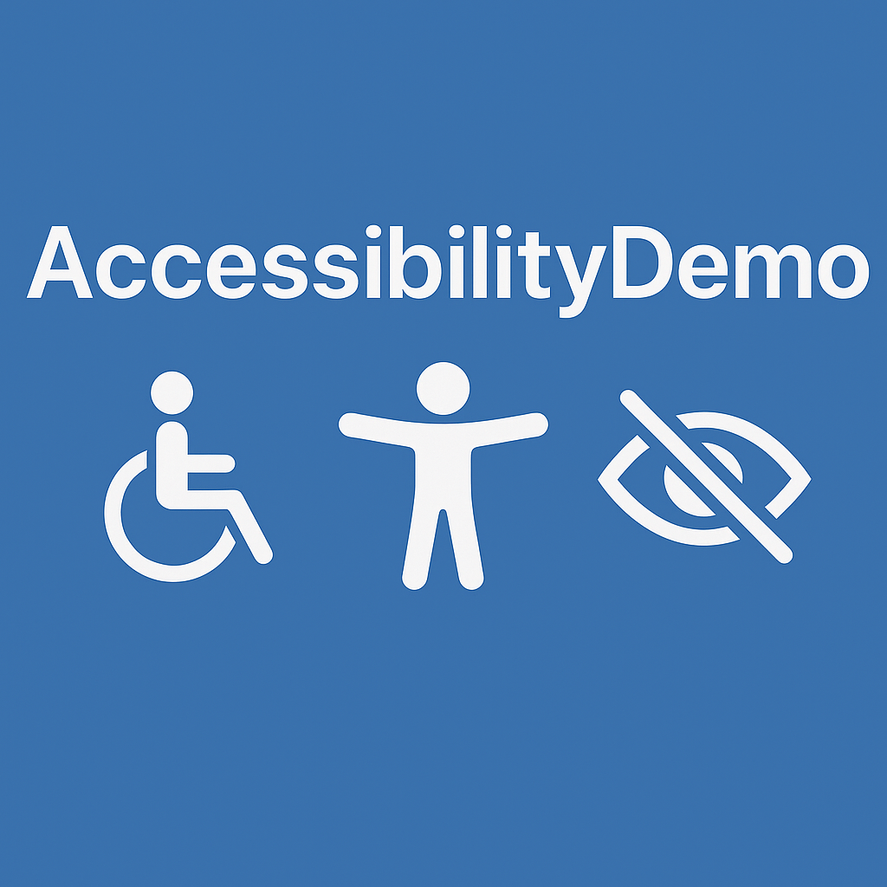
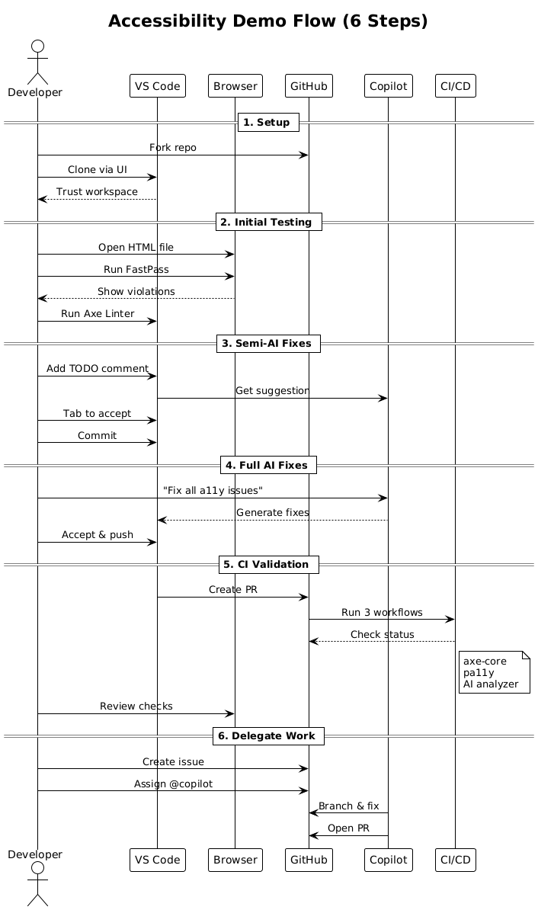

# AI Accessibility Demo 



This [repository](https://github.com/roryp/accessibilitydemo) demonstrates how to use AI tools like GitHub Copilot to fix accessibility issues in web applications, moving from manual testing to full automation.

> **Flow:** Manual discovery → Semi-AI fixes → Full-AI agent → CI validation



## Prerequisites

- VS Code with GitHub Copilot
- Chrome/Edge browser
- Install these extensions:
  - [Accessibility Insights for Web](https://accessibilityinsights.io/)
  - [Axe Linter for VS Code](https://marketplace.visualstudio.com/items?itemName=deque-systems.vscode-axe-linter)

## Complete Demo Flow

### 1. Setup (UI only)
   - **Fork** the repository on GitHub
   - In VS Code choose **File → Clone Repository** and paste the URL of **your fork**
   - Open the workspace and choose **Trust** when prompted

### 2. Initial Testing - Accessibility Insights & Axe Linter
   - Open **`accessibility-issues-demo.html`** in Chrome/Edge
   - Click the **Accessibility Insights for Web** extension icon
   - Run a **FastPass** to capture an automated + tab stops report
   - In VS Code, check the **Problems** panel for Axe Linter issues

### 3. Semi-AI Fixes with Copilot Completions
   - Add guiding comments like `<!-- TODO: add alt text -->` and press **Tab**
   - Stage changes and commit through Source Control panel

### 4. Full AI Fixes with Copilot Agent
   - Open **Copilot Chat** (Ctrl+Alt+I)
   - Prompt:
     ```
     Fix all accessibility issues in accessibility-issues-demo.html to meet WCAG 2.1 AA standards. 
     Address color contrast, semantic structure, headings, labels, alt text, focus management, 
     keyboard accessibility, and any other common accessibility problems.
     ```
   - Review → Accept → Commit & Push

### 5. Continuous Validation - GitHub Actions
   - Three workflows run automatically on PR creation:
     - **accessibility-check.yml** - axe-core testing with HTML reports
     - **pa11y.yml** - WCAG2AA compliance testing  
     - **ai_accessibility_check.yml** - AI-powered analysis
   
#### 5.1 (Optional): Enable Enhanced AI Analysis (needed for ai_accessibility_check.yml)

- **Get a GitHub Models Token**:
  - Visit [GitHub Models Marketplace](https://github.com/marketplace/models)
  - Sign up for GitHub Models access
  - Generate an API token
- **Add Repository Secret**:
  - Go to your repository settings
  - Navigate to Secrets and variables → Actions
  - Click "New repository secret"
  - Name: `MODELS_TOKEN`
  - Value: Your GitHub Models API token

### 6. Delegating Future Work to Copilot Agent
   - [Enable Copilot agent access](https://github.com/settings/copilot/coding_agent) to work on all repositories
   - Create a GitHub issue: "Implement keyboard-only navigation support"
   - Assign to **@github-copilot**
   - The agent creates a branch, commits fixes, and opens a PR

## What You'll Learn

You'll fix 13+ accessibility violations:
- ❌ Poor color contrast → ✅ WCAG compliant colors
- ❌ Missing alt text → ✅ Descriptive image labels  
- ❌ Wrong heading order → ✅ Proper H1→H2→H3 hierarchy
- ❌ Unlabeled forms → ✅ Accessible form controls

## Key Takeaways

| Stage | Tool | Interaction |
|-------|------|-------------|
| Manual snapshot | Accessibility Insights FastPass | Browser extension |
| Real-time hints | Axe Linter | VS Code Problems panel |
| Semi-AI fixes | Copilot completions | Inline in VS Code |
| Full AI fix | Copilot coding agent | VS Code Chat |
| Safeguards | Three GitHub Actions | PR Checks tab |

## Quick Testing

- **Keyboard navigation**: Tab through both HTML files
- **Screen reader**: Test with NVDA, JAWS, or VoiceOver
- **Browser tools**: Run Lighthouse accessibility audit

## Resources

- [WCAG 2.1 Guidelines](https://www.w3.org/WAI/WCAG21/quickref/) - Target **Level AA** for best practice
- [Copilot coding agent](https://docs.github.com/en/enterprise-cloud@latest/copilot/concepts/about-copilot-coding-agent)
- [Accessibility Insights](https://accessibilityinsights.io/) - Microsoft's testing tools

---

### How the Initial HTML Test Files Were Created

```
@workspace create a simple html file to showcase how to fix accessibility issues. make the page deliberately non-accessible with a few issues. use plain html
```
