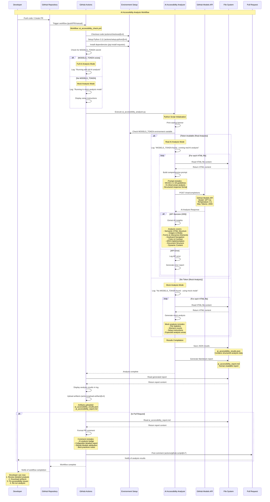
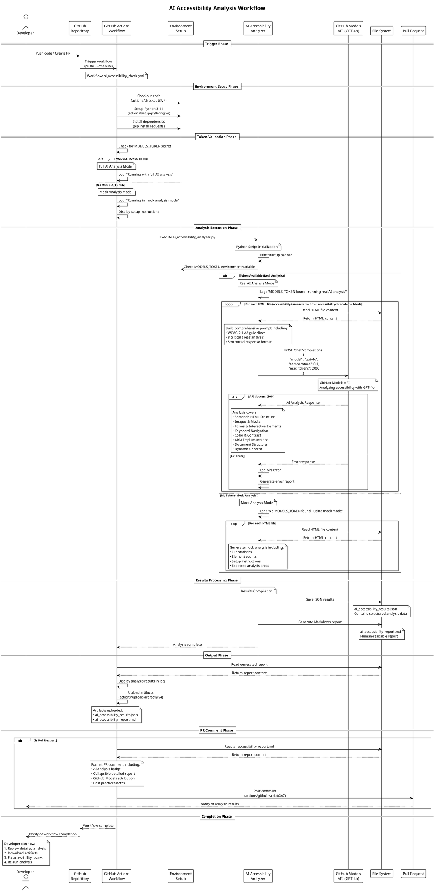

# AI Accessibility Analysis - Detailed Sequence Diagram

## Overview
This sequence diagram illustrates the complete flow of the AI-powered accessibility analysis system, from code push to final report generation.

## PlantUML Version

## Detailed Component Breakdown

### 1. Workflow Triggers
- **Push Events**: main/master branch pushes
- **Pull Request Events**: PR creation/updates to main/master
- **Manual Dispatch**: workflow_dispatch for on-demand execution

### 2. Environment Setup
- **Ubuntu Latest**: Consistent Linux environment
- **Python 3.11**: Modern Python with full feature support
- **Dependencies**: Minimal - only `requests` for API calls

### 3. Token Management
- **Optional MODELS_TOKEN**: Graceful degradation without token
- **Security**: Token accessed via GitHub Secrets
- **Flexibility**: Works in both authenticated and mock modes

### 4. Analysis Engine (ai_accessibility_analyzer.py)

#### Core Functions:
- `call_github_models()`: Handles API communication
- `mock_analysis()`: Provides fallback analysis
- `analyze_html_file()`: Processes individual HTML files
- `main()`: Orchestrates the entire analysis process

#### Analysis Scope:
1. **Semantic HTML Structure**: Heading hierarchy, landmarks, semantic tags
2. **Images & Media**: Alt text quality, decorative vs informative images
3. **Forms & Interactive Elements**: Labels, fieldsets, error handling
4. **Keyboard Navigation**: Tab order, focus indicators, skip links
5. **Color & Contrast**: WCAG compliance, color-only information
6. **ARIA Implementation**: Proper attributes, roles, states
7. **Document Structure**: Language attributes, meta information
8. **Dynamic Content**: Live regions, status updates

### 5. Output Generation
- **JSON Results**: Machine-readable structured data
- **Markdown Report**: Human-readable formatted analysis
- **GitHub Artifacts**: Persistent storage of results
- **PR Comments**: Contextual feedback in pull requests

### 6. Error Handling
- **API Timeouts**: 60-second timeout for stability
- **File Not Found**: Graceful handling of missing files
- **Token Issues**: Clear messaging and fallback options
- **Network Errors**: Comprehensive error reporting

## Integration Points

### GitHub Actions Integration
- Permissions: `contents:read`, `pull-requests:write`, `issues:write`
- Artifacts: Automatic upload and retention
- Comments: Automated PR feedback

### GitHub Models API Integration
- Model: GPT-4o for advanced reasoning
- Temperature: 0.1 for consistent, focused analysis
- Max Tokens: 2000 for comprehensive responses
- Authentication: Bearer token via environment variable

### File System Integration
- Input: HTML files for analysis
- Output: JSON and Markdown reports
- Encoding: UTF-8 for international character support

## Usage Patterns

### For Developers
1. **Push Code**: Automatic analysis on push/PR
2. **Review Results**: Check PR comments or workflow logs
3. **Download Reports**: Access detailed artifacts
4. **Fix Issues**: Implement recommended changes
5. **Iterate**: Re-run analysis after fixes

### For Teams
1. **Consistent Standards**: Automated accessibility checks
2. **Educational Tool**: Learn from AI recommendations
3. **Quality Gates**: Prevent accessibility regressions
4. **Documentation**: Historical analysis records

This sequence diagram represents a comprehensive, production-ready accessibility analysis system that combines AI intelligence with practical CI/CD integration.
